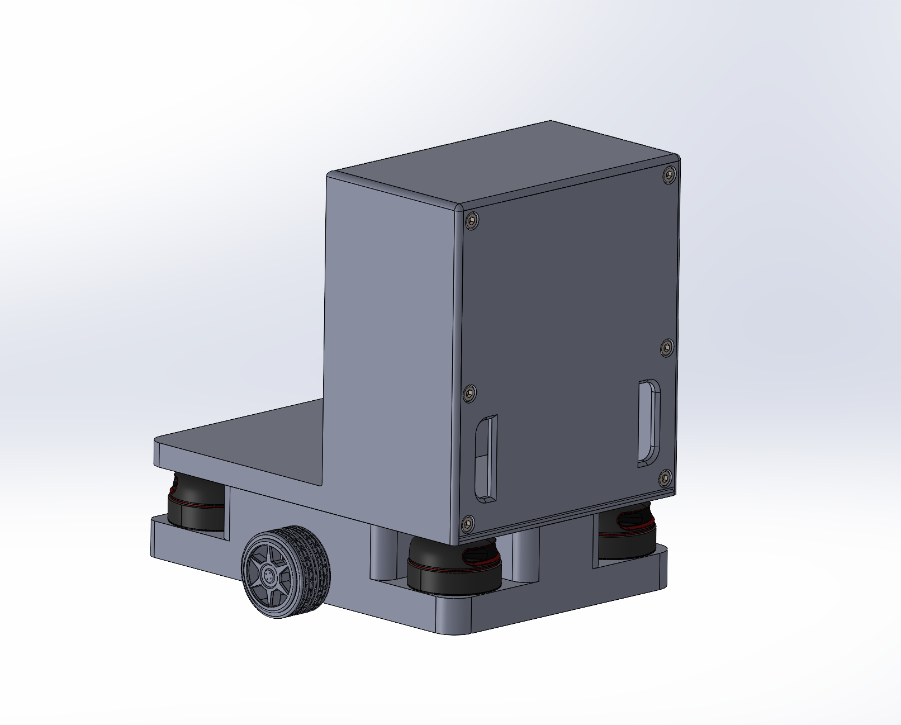
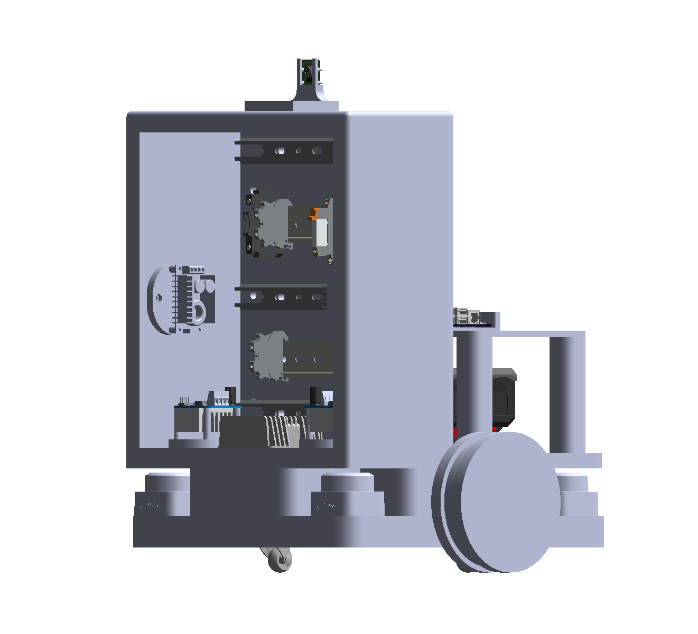
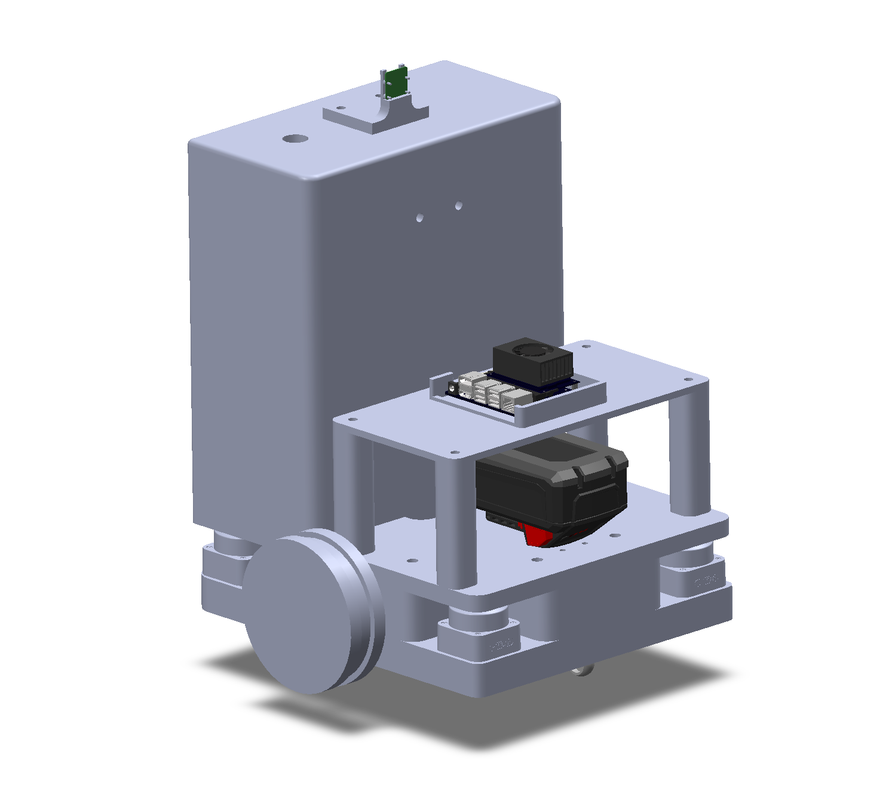

# Shopping Cart AMR — Diploma Project


Robots have undeniably made our lives better. As years pass, new types of robots appear that assist humans even more. This project's objective is to develop a mobile robot capable of helping people inside supermarkets. The robot's purpose in this scenario is to replace the conventional shopping cart — eliminating the need to push or pull it around, and enabling wheelchair users to move more freely.

The robot is capable of autonomous navigation on a pre-built map, human/object detection and following using a YOLOv8 TensorRT model running at 207 FPS on the Jetson's GPU, and full remote control via a purpose-built web interface accessible from any device on the local network.

## System Architecture

### Hardware

| Component | Details |
|---|---|
| Compute | NVIDIA Jetson Orin Nano Super (8GB unified memory) |
| Motors | 2× 12V DC motors with quadrature encoders |
| Motor Drivers | 2× H-bridge motor driver modules |
| LiDARs | 4× SLAMTEC RPLIDAR C1 (one per corner, merged into a single scan) |
| Camera | Raspberry Pi Camera Module (CSI, 640×480 @ 30fps via GStreamer/Argus) |
| Chassis | Custom-designed in SolidWorks, 360×360mm differential drive base |

### Software Stack

| Layer | Technology |
|---|---|
| Robot OS | ROS2 Humble |
| Navigation | Nav2 (AMCL + NavFn planner + Regulated Pure Pursuit controller) |
| Localization | AMCL with pre-built map + EKF sensor fusion (wheel odometry + laser odometry) |
| Laser odometry | rf2o (scan-to-scan ICP, wheel-independent) |
| Object detection | YOLOv8n → TensorRT FP16 engine (207 FPS, 4.75ms GPU latency) |
| SLAM | slam_toolbox (used during mapping mode) |
| Web interface | Custom C++ Boost.Beast HTTP/WebSocket server + rosbridge |
| Build system | colcon / CMake |

## Packages

### Community packages
- **Nav2** — autonomous navigation stack (planner, controller, costmaps, behavior trees)
- **slam_toolbox** — online async SLAM for map creation
- **sllidar_ros2** — SLAMTEC LiDAR driver
- **rf2o_laser_odometry** — laser-based odometry, used alongside wheel encoders in the EKF
- **robot_localization** — EKF node fusing `/custom_odom_topic` (encoders) and `/odom_rf2o` (laser)

### Custom packages

#### `camera_module` (C++)
Publishes the Raspberry Pi camera stream to `/camera` using GStreamer/Argus at 30fps. Uses `SensorDataQoS` (Best Effort) to match downstream subscribers.

#### `human_detection_module` (C++)
YOLOv8n inference node running on TensorRT 10.3 FP16. On first launch it builds a serialized engine from `yolov8n.onnx` (takes ~10 minutes on first run, then cached permanently at `~/.ros/human_detection/yolov8n.engine`). Subsequent launches load the cached engine in under one second.

- Subscribes to `/camera` with `SensorDataQoS`
- Publishes `/yolo/debug_image` — live camera feed with bounding boxes drawn in real time
- Publishes `/yolo/target_pose` — 3D position of the tracked object in `camera_link` frame, estimated using the focal length and bounding box height
- Exposes `/detector/set_class` service (`std_srvs/SetBool`) — `false` = track person (class 0), `true` = track sports ball (class 32), for testing without a person present
- Parameters: `confidence_threshold` (0.50), `nms_threshold` (0.45), `focal_length_px` (500)

#### `mode_manager_module` (C++)
Central state machine managing the robot's five operating modes. Receives mode commands from the web UI on `/ui/mode/absolute` and routes velocity commands from the appropriate source to `/cmd_vel`.

| Mode | Velocity source | Behaviour |
|---|---|---|
| `IDLE` | — | Motors stopped |
| `MANUAL` | `/cmd_vel_teleop` | Joystick/D-pad from web UI |
| `MAPPING` | `/cmd_vel_teleop` | Manual drive while slam_toolbox builds a map |
| `NAVIGATION` | `/cmd_vel_nav2` | Autonomous point-to-point navigation via Nav2 |
| `FOLLOWING` | `/cmd_vel_nav2` | Follows the detected target using Nav2 as the path executor |

Switching out of `MAPPING` automatically saves the map, stops slam_toolbox, and reactivates AMCL. Switching out of `NAVIGATION` or `FOLLOWING` cancels any active Nav2 goal.

#### `scan_merger_module` (C++)
Merges the four LiDAR scans (front-left, front-right, back-left, back-right) into a single `/scan` topic in the `custom_base_link` frame. Uses cached TF transforms for zero-overhead merging at runtime.

#### `web_server` (C++)
Custom HTTP server built with Boost.Beast that hosts the robot control interface. No external web server or framework needed — the binary serves static files and handles all API calls and MJPEG streams directly.

Endpoints:
- `GET /` — main control page
- `GET /stream/camera` — MJPEG stream of the raw `/camera` topic (~20 FPS cap)
- `GET /stream/debug` — MJPEG stream of `/yolo/debug_image` with bounding box overlay
- `GET /api/robot/state` — current robot state as JSON
- `GET /api/robot/mode` — current mode as JSON
- WebSocket (via rosbridge on port 9090) — map data, odometry, mode commands, nav goals

#### `robot_driver` (Python)
Motor controller node managing GPIO PWM output to the two H-bridge drivers and reading quadrature encoder ticks to compute wheel odometry. Publishes to `/custom_odom_topic` (`nav_msgs/Odometry`). The EKF node is the sole publisher of the `custom_odom → custom_base_link` TF transform.

#### `system_bringup`
Launch file, Nav2/AMCL/EKF configuration, URDF robot description, pre-built map, behavior trees, and RViz config. The launch sequence is staged to ensure hardware initializes in the correct order before navigation nodes start.

## TF Tree

```
map
 └── custom_odom          ← AMCL publishes map→custom_odom
      └── custom_base_link ← EKF publishes custom_odom→custom_base_link
           ├── camera_link
           ├── lidar_front_left
           ├── lidar_front_right
           ├── lidar_back_left
           └── lidar_back_right
```

## Launch Sequence

The system starts in 6 staged steps to prevent race conditions between hardware init and software dependencies:

```
Stage 1  — Robot state publisher (URDF → TF static transforms)
Stage 2  — 4× LiDAR nodes (staggered 1s apart)
Stage 2.5 — Scan merger, motor controller, camera publisher
Stage 2.75 — rf2o laser odometry, EKF node
Stage 3  — AMCL + map server (localization active)
Stage 4  — Nav2 composable container
Stage 5  — Nav2 nodes (controller, planner, behavior server, bt_navigator)
Stage 6  — Web server, rosbridge, YOLO detection node, RViz
```

```bash
# Build
cd ~/Projects/Shopping-Cart-AMR-Diploma-Project
colcon build --symlink-install
source install/setup.bash

# First launch only: build the TensorRT engine outside ROS
# (takes ~10 minutes, cached permanently afterwards)
/usr/src/tensorrt/bin/trtexec \
  --onnx=src/human_detection_module/model/yolov8n.onnx \
  --saveEngine=/home/$USER/.ros/human_detection/yolov8n.engine \
  --fp16

# Launch everything
ros2 launch system_bringup robot_system.launch.py
```

Then open `http://<jetson-ip>:8080` in any browser on the same network.

## Web Interface

The control interface runs entirely in the browser with no installation required.

| Panel | Function |
|---|---|
| **IDLE** | Standby screen with animated status ring |
| **MANUAL** | Live camera feed + D-pad + speed slider (0.1–1.0 m/s) |
| **NAVIGATE** | ROS2D.js map + coordinate input + dispatch/abort goal buttons |
| **FOLLOW** | Detection feed with bounding boxes + target selector (Human / Sports Ball) + Start/Stop Following |

## Robot 3D Model

The robot has been designed entirely in SolidWorks. It consists of two main assemblies:

- **Robot Base** — main structural body holding the motors, LiDARs, caster wheels, and shopping basket mount
- **Robot Panel** — internal panel designed to house all electrical components



<p float="left">
  
  
</p>

## Results

Demonstrations of the robot performing on hardware.

### Localization

[](https://www.youtube.com/watch?v=b-eXOFlw1KQ)

### Navigation to a Target

[](https://www.youtube.com/watch?v=DEMlTes20ME)

### Dynamic Point Follower

[](https://www.youtube.com/watch?v=rmnldiNaGu0)