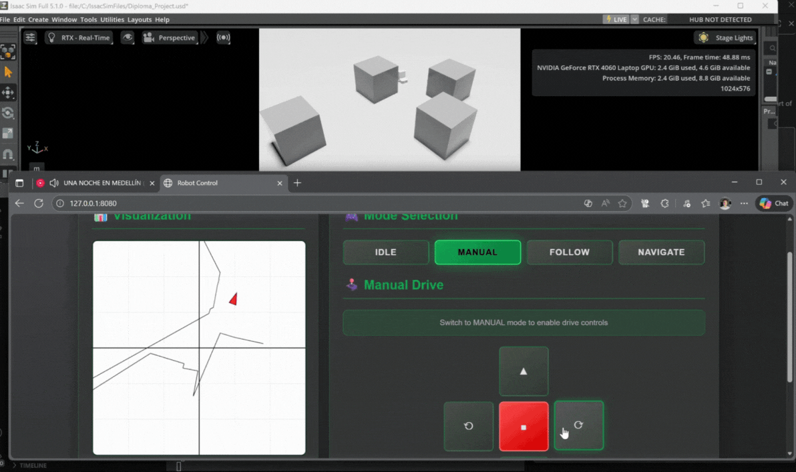

# Shopping Cart AMR - Diploma Project
## [ONGOING DEV]

Robots have undeniably made our lives better. As years pass, new types of robots appear that assist humans even more.
This project's objective is to develop a mobile robot capable of helping people inside supermarkets.
The robot's purpose in this scenario is to replace the conventional shopping cart. By doing so, we not only eliminate the need to pull or push the shopping cart around the supermarket, but we also enable wheelchair users to move more freely.

## System Architecture

### Hardware:
- NVIDIA Jetson Orin Nano
- 2x 24VDC Motors with encoders 
- 2x Motor Drivers
- 4x LiDARs 
- Raspberry Pi Camera Module

### Software:
- ROS2 Jazzy
- Navigation2
- SlamToolbox
- YOLOv8
- OpenCV
- Custom C++/Python packages

## Packages 

The project makes use of both custom packages and community-based packages.

### Community-based:
- Navigation2
- SlamToolbox

### Custom packages:
- **Camera C++ package** -> Publishes the camera stream to a topic.
- **Human detection Python package** -> Detects humans based on the camera stream.
- **Mode manager C++ package** -> Dynamically manages the robot's operation modes.
- **Scan merger C++ package** -> Merges data from the 4 LiDARs.
- **System launcher package** -> Launches all nodes based on specific conditions.

[*Other packages are still in development*]

## Simulation

The robot was initially built inside a simulation. 
For the simulation, I used NVIDIA Isaac Sim 5.1.0 due to its compatibility with ROS2 Humble/Jazzy.

Below is a short demo video of how the robot moves inside the simulation.

* **Upper half:** The Isaac Sim window showing the simulated robot.
* **Lower half:** The Web UI enabling the user to control the robot.

## Real world results
[*Project is still ongoing...*]